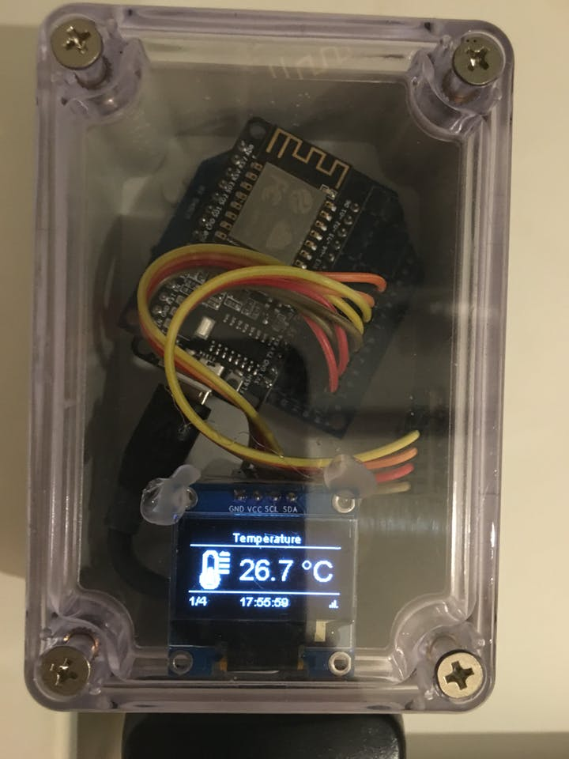

## Homie BME280 - The Sensor

The mqtt-bme280-homie sensor project is a small and easy to integrate temperature, air pressure and humidity monitoring solution with an extra SSD1306 OLED display. Sensor data is send via MQTT and displayed on the small screen. Local time is loaded via NTP. The project is built with a cost-effective ESP8266 WiFi chip.

The software is based on [Homie](https://github.com/marvinroger/homie-esp8266) to enable an easy integration with home automation systems like [OpenHab](http://www.openhab.org/).



The display shows 4 screens (can be extended) in a carousel mode. temperature, humidity, air pressure and some status like IP address.

### Hardware components

-   ESP8266 (Wemos D1 mini, Nodemcu)
-   BME280 sensor breakout
-   SSD1306 OLED display
-   USB power supply and cable
-   Enclosure

I got the BME280 breakout form [Adafruit](https://www.adafruit.com/product/2652), others will do as well. The SSD1306 OLED displays I ordered at Aliexpress. This [enclosure](https://www.amazon.de/gp/product/B00PZYMLJ4) keeps everything together. Wiring is pretty simple since both sensor and display connect via I2C bus with the ESP.

### Software

The following software libraries are used. If using PlatformIO all dependencies are resolved automatically.

-   [Homie V2](https://github.com/marvinroger/homie-esp8266) (dev) including dependencies
-   [Adafruit BME280 Driver](https://github.com/adafruit/Adafruit_BME280_Library)
-   [Adafruit Unified Sensor](https://github.com/adafruit/Adafruit_Sensor)
-   [SSD1306 driver for ESP8266 platform](https://github.com/squix78/esp8266-oled-ssd1306)
-   [NTPClient to connect to a time server](https://github.com/arduino-libraries/NTPClient)
-   Optionally PlatformIO environment for building the code

<github url="https://github.com/mhaack/mqtt-bme280-homie" title="Source code on GitHub"/>

### Reading sensor data

The senoor data is published via MQTT according to the Homie spec. It can be read with any MQTT client:

```
homie/mqtt-sensor-livingroom/sensor/temperature 24.58
homie/mqtt-sensor-livingroom/sensor/humidity 32.67
homie/mqtt-sensor-livingroom/$stats/signal 94
homie/mqtt-sensor-livingroom/$stats/uptime 17126998
```

### Config

The software can be configured via MQTT (or Homie config file), also while running. You can set `sensorInterval` to control the reading intervals and how often data will be published via MQTT. Additionally a `temperatureOffset` can be set, especially if installed within some box the BME280 sensor will give some slightly of temperate values because of the heat the  ESP chip emits. Rotating the display is also possible by set the `flipScreen` parameter to true.
