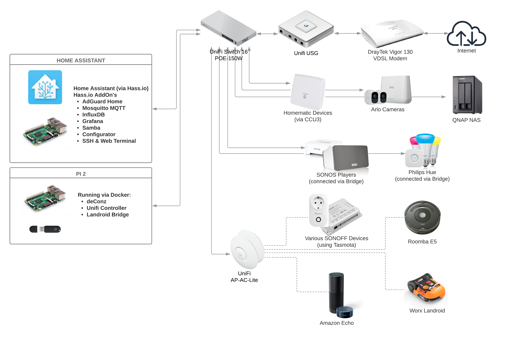

## From OpenHab to Home Assistant

This “project” is about the change I did from [OpenHab](https://www.openhab.org) to [Home Assistant](https://www.home-assistant.io) for our smart home automation system. Ok maybe the headline sounds a bit too sensational but change our entire home automation setup from one system we used for 2+ years now to a completely new one requires quite some heavy lifting.

Let's start from the beginning. I’m running a smart home system for our house for almost 3 years now. I started with OpenHab 1 and quickly moved to OpenHab 2. I always wanted a system with local control and not cloud connection required, at least not by default. I also wanted to be vendor in-depended and don’t install a ton of apps on my smartphone. So OpenHab was a pretty good choice and already stable solution, they also have a quite large community in Germany and support a few more local system like [Homematic](https://www.homematic.com) which are not known elsewhere. The initial reason why I decided to go with OpenHab was the very good support for the Homematic ecosystem, maybe the best you can get at the moment.

## So why change a running system?

Maybe 6 months ago I decided to move the smart home controller from OpenHab to Home Assistant. So why looking for an alternative? I was dissatisfied with the overall situation of OpenHab. This is not bashing on OpenHab, this is only about my personal opinion and view on it - which changed over time. Both systems are very powerful home automatic systems with a ton of integrations and both fulfill my requirement of being local and cloud independent.

This was actually the 3rd time I looked into Home Assistant, two times I put it away and decided to stay with OpenHab. I finally decided now is the time for something new because I’m not happy with OpenHab process anymore. OpenHab moves slowly with yearly major releases (I know there are milestones now as well) and the core team spends very much time to keep the platform stable while continue to improve it. But there is not so much improvement on the integration side. While I was happy with how Homematic, Hue, Sonos, etc. are integrated other devices we have like Rademacher, Roomba or Ubiquiti took a very long time or are not available.
Home Assistant, on the other hand, moves very quickly, they have a release every 2-3 weeks, adding new integrations with every minor release while fixing bugs and improving the core - pretty impressive pace. All except one (Landroid) integrations I was looking for are available for Home Assistant and also the Homematic integration has improved a lot (compared to when I looked at HA the first time).

## A new smart home automation system

The old system was running on a RaspberryPI and for Home Assistant I keep it like that. The hass.io installer is a great help, the new system was up and running in minutes. Hass.io also has a large collection of add-ons. Installing other core services in I need like Mosquitto, InfluxDB or Grafana was just a few clicks.
Many of Home Assistant users run the system and bigger machines like Intel NUC maybe I will upgrade sometime later for now I’m fine with the RaspberryPI.

My current setup looks like the following:

  

Moving over my environment from OpenHab to Home Assistant did not take that long, maybe 7 or 8 evenings and most of the integrations, devices and automations/rules were working. I decided to configure everything file based, also did that in the past. That allows me to keep the entire config in Git, track changes easily and restore the entire system in case something breaks. Following the Home Assistant community best practices I also share my config on GitHub.

The biggest difference in configuration from my point of view is the rules aka. automatons. OpenHab has a powerful rule programming language and with the new next-gen rule engine any programming language can be used. Creating some rule here is like programming something. In Home Assistant by default one defines the automations in YAML. This is much more descriptive than programming something. At the beginning, I was little skeptical if that fulfills all my needs, but it did expect from some small exceptions where I create Python scripts to do the job. As an alternative one can plugin AppDeamon or NodeRed as well.

The Lovelace UI of Home Assistant is much more powerful than OpenHab's sitemap approach for the Basic UI. I know OpenHab has HABPanel as well but I never got really used to it.

## Integrations

Over time we collected a long list of devices from different vendors. These are the platforms, integrations, and devices we use:

-   Homematic
-   Philips Hue
-   Xaiomi ZigBee sensors
-   Apple HomeKit
-   Rademacher Duofern
-   Amazon Echo
-   Sonos Players
-   Roomba E5
-   Worx Landorid lawnmower robot
-   SonOff devices (using [Tasmota](https://github.com/arendst/Sonoff-Tasmota))
-   DIY Arduino devices connected via MQTT
-   Uquiti Unifi network equipment
-   Qnap NAS
-   Fritzbox

Home Assistant support has integrations for 1000+ systems and devices and also OpenHab’s add-on list is at the same length. Add details list of all hubs, devices, sensors etc. I used is available on my [Home Assistant config](https://github.com/mhaack/home-assistant-config) on GitHub.

<github url="https://github.com/mhaack/home-assistant-config" title="Home Assistant config"/>

## Community support

I think both platforms have a great community, always will support and help. But to me, it feels that [HA community](https://www.home-assistant.io/help/) is much more active and bigger. OpenHab community has a few very knowledgeable members. They are very active and supportive but at the end of the day, it very often comes back to a small group which answers the majority of questions.

Home Assistant community, in contrast, is much bigger, it is not only the active forum, they also have a Discord server to get in touch with community and core developers, many people share their configs public on GitHub (which was a huge boost for me when I started to migrate) or running very active YouTube channels. And there is a regular podcast as well.
So far I only asked a handful of questions on the community forum and always got help.

## Some final thoughts

While I would consider my switch to Home Assistant as done and already have archived my OpenHab installation I know it will never be really finished. There is always some stuff to tinker and improve. I already have a to-do list of 15 items ;-)

I am sure, for me, moving to Home Assistant was the right choice. And I definitely recommend to everybody who is willing to invest some time into building a local and flexible smart home solution to have a look at Home Assistant. Is Home Assistant a perfect solution? No, no smart home hub is, all have strengths and weaknesses. Also as written above OpenHab is a mature piece of software. But among these both - Home Assistant and OpenHab - Home Assistant is now the perfect fit for me.
