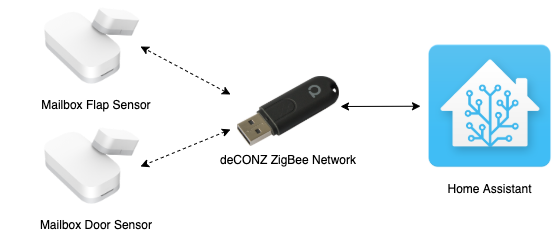
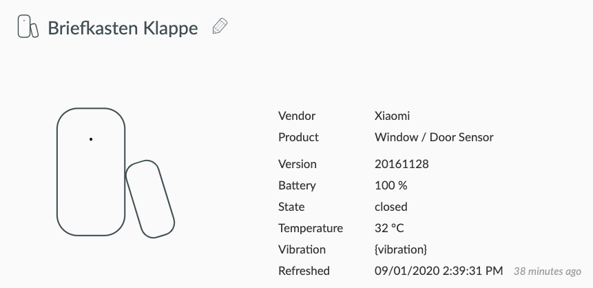
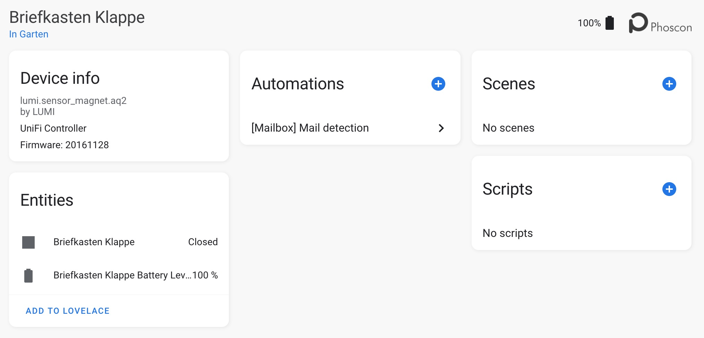
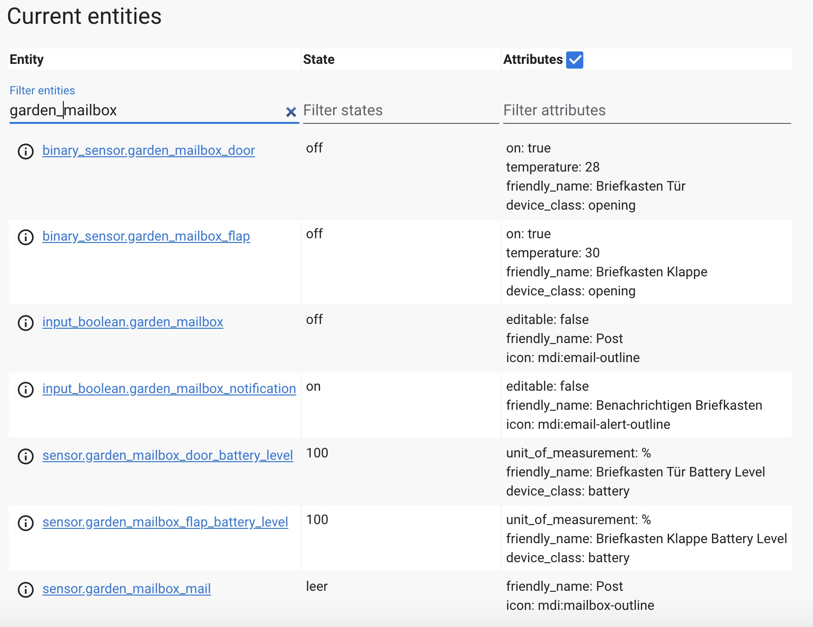

Today I want to share a little holiday project I build this week: a mailbox sensor notifying us if we got new mail. Including a reminder to empty the mailbox in case we forgot about that.

## How does it work?

The project is build using two Xiaomi ZigBee contact sensors I had leftover. Our [smart home setup](/jama-villa) already has a ZigBee network running using a Conbee II stick. Of course, it is integrated with Home Assistant already.

This is a how it looks like:



## The hard(ware) part

Devices needed for this project:

* 2 ZigBee contact sensors (e.g. Xiaomi...)
* ZigBee network (for example via Deconz)
* Home Assistant
* Duck tape, hot glue, etc. 

The setup depends a little on the construction of the actual mailbox. Ours has a flap on the front side where the mail is thrown in and a door on the backside to empty it. So I needed two sensors, one to detect if the mail was inserted and a second one to detect when we cleared the mailbox. For a mailbox with just one door or flap, only one sensor would be needed. Our mailbox is made of metal, like most mailboxes here, built into a concrete column. I first thought having a metal frame like this might be problematic with the ZigBee signal but that is not the case.

For a first prototype, I just duck taped the sensor inside the mailbox. The door the original magnet was too small so I replaced it with a bigger one.

FOTO
https://www.flickr.com/photos/8058853@N06/2685196800

## The fun part

With the hardware part assembled we can now have a look at the software part. Since our ZigBee network was already running it was easy to connect the two new sensors via the Deconz UI.



With Deconz integrated into Home Assistant the new sensors are immediately available in Home Assistant as well.



Adding some ZigBee sensors to Home Assistant - pretty easy. Additionally to the two deCONZ sensors I use one boolean input helper plus a corresponding template sensor to keep the state of there is mail or not. deCONZ also creates battery level sensors for each battery-powered device. These are not really used here, but there are other automations that notify us of batteries running low.  For convenience one more boolean input helper is used to enable/disable the mailbox notifications. In total there are 5 sensors and 2 inputs used for this project.



The last step is to build out the automations. I’m still having all automations in YAML, so the mailbox automations are added here as well. For the mailbox sensor three automations are needed:

1. set the mailbox state if the mail was inserted
2. Reset the mailbox state once we have cleared the mailbox
3. Reminder in case we forgot to empty the mailbox in the evening

All of them are relatively simple and short. The mail detection automation is executed when the flap of the mailbox has been opened the sensor triggered. It sets the mail state to on and sends a notification.

```yaml
---
alias: "[Mailbox] Mail detection"
trigger:
  - platform: state
    entity_id: binary_sensor.garden_mailbox_flap
    from: "off"
    to: "on"
action:
  - service: input_boolean.turn_on
    data:
      entity_id: input_boolean.garden_mailbox
  - condition: state
    entity_id: input_boolean.garden_mailbox_notification
    state: "on"
  - service: notify.mobile_app_xyz
    data:
      title: JaMa Villa - 📬
      message: Trari, trara, die Post ✉️ ist da!
      data:
        push:
          thread-id: "ha-mailbox-notification-group"
```

The mailbox door automation is even simpler. It just resets the mail status to off if the mailbox door got open which is the indication that the mailbox has been emptied.

```yaml
---
alias: "[Mailbox] Reset"
trigger:
  - platform: state
    entity_id: binary_sensor.garden_mailbox_door
    from: "off"
    to: "on"
action:
  - service: input_boolean.turn_off
    data:
      entity_id: input_boolean.garden_mailbox
```

The reminder automation is also very simple. At a certain time it checks the mailbox state and sends us a reminder in case there is still mail in the mailbox. We decided to have two reminders: first at 6 pm, second at 8 pm.

```yaml
---
alias: "[Mailbox] Notification"
trigger:
  - platform: time
    at:
      - "18:00:00"
      - "20:00:00"
condition:
  - condition: state
    entity_id: input_boolean.garden_mailbox_notification
    state: "on"
  - condition: state
    entity_id: input_boolean.garden_mailbox
    state: "on"
action:
  - service: notify.mobile_app_xzy
    data:
      title: JaMa Villa - 📬
      message: Der Briefkasten wurde noch nicht geleert, da ist noch ✉️ drin.
      data:
        push:
          thread-id: "ha-mailbox-notification-group"
```

That is, not much needed for this little fun project.

Our complete Home Assistant config can be found at GitHub.