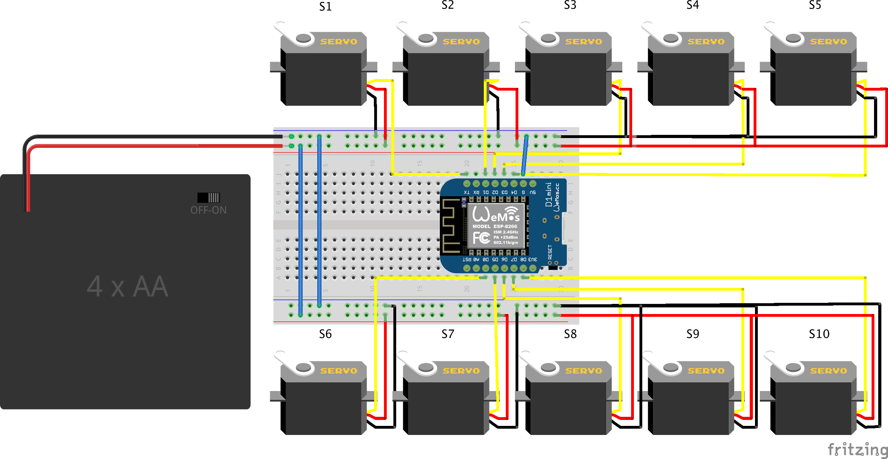
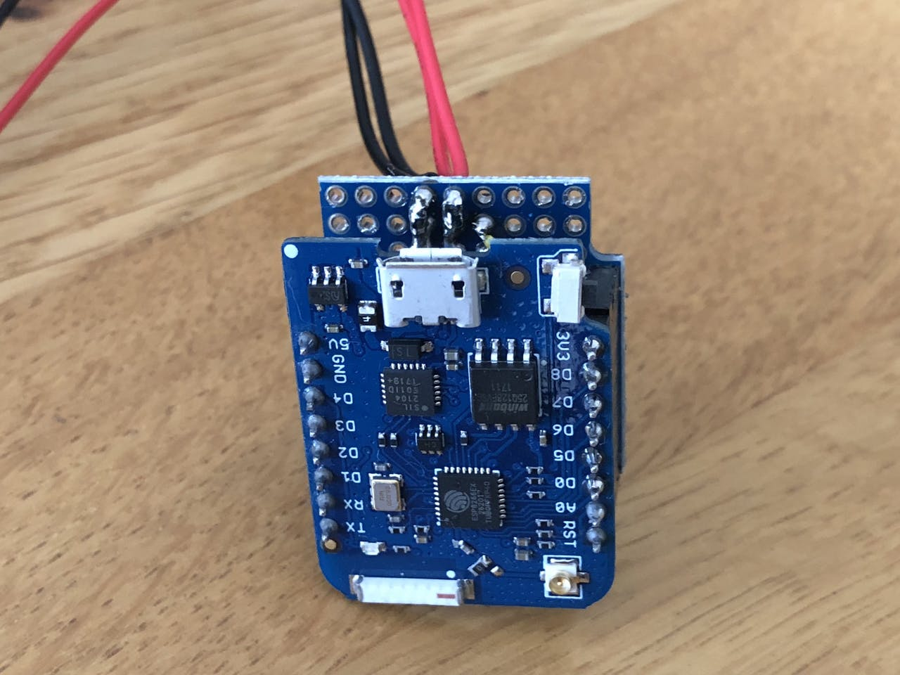
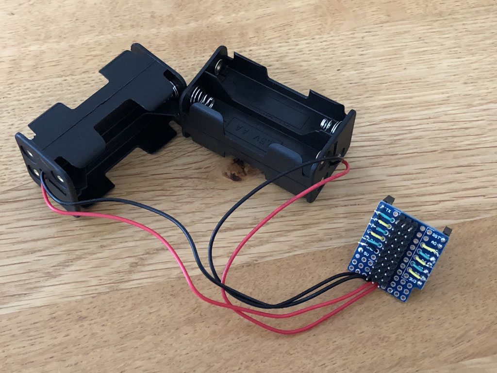
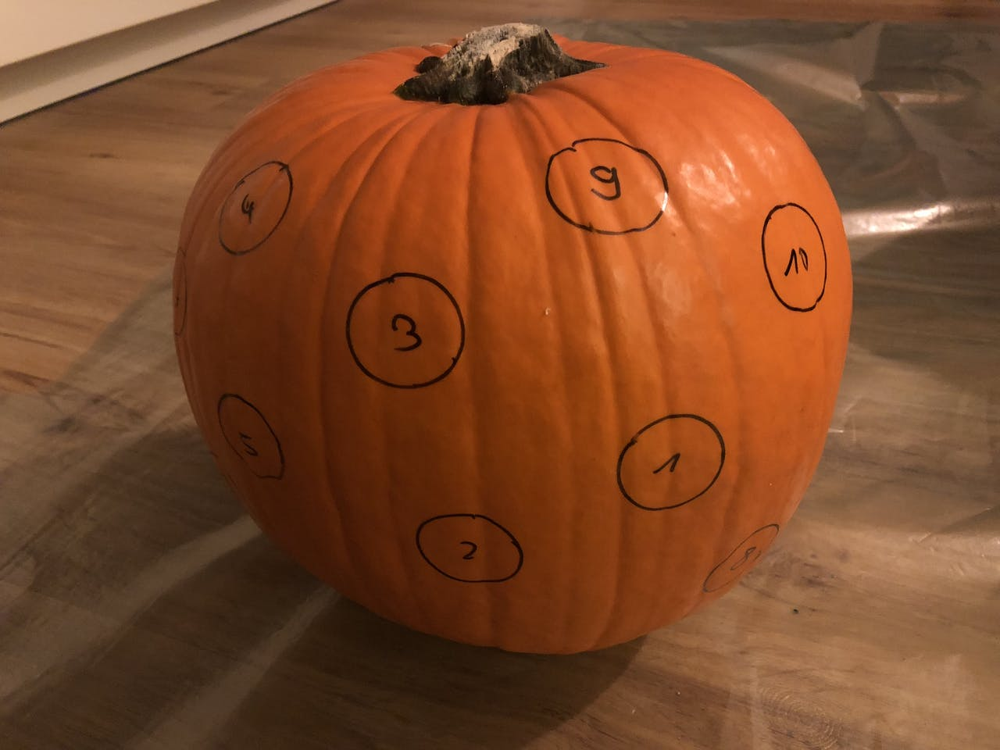
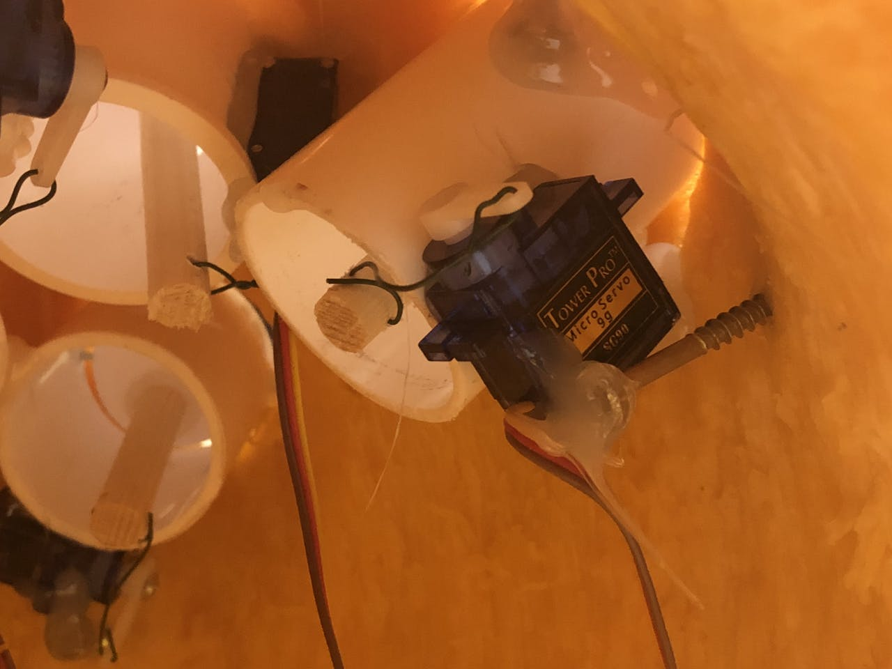
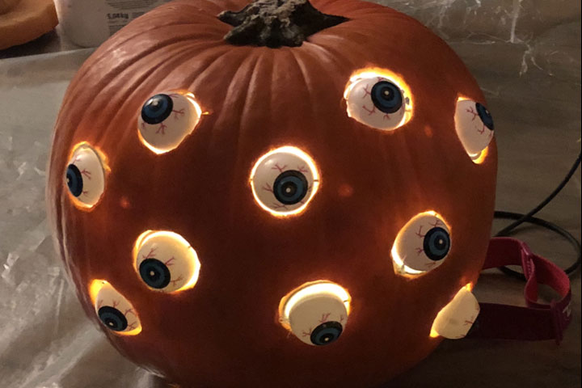

## Story

Halloween is coming in a few days and here is the first of my Halloween projects this year. I wanted to rebuild an cool Arduino project I found on [YouTube](https://youtu.be/ryUNHPJ3leY) - the pumpkin with moving eyes.

<iframe width="615" height="352" src="https://www.youtube.com/embed/8-jia1-PfCQ" frameborder="0" allow="accelerometer; autoplay; encrypted-media; gyroscope; picture-in-picture" allowfullscreen></iframe>

The project is not that complicated and easy to rebuild. Now we see how to do that.

### Parts

The following components are used for this project:

-   A pumpkin
-   10 creepy plastic eyes
-   10 mini servos, for example SG90
-   Thin wire
-   Thin nails
-   Plastic tube (inner diameter a little bit bigger than the eyes)
-   Wooden or plastic stick with ~ 8mm diameter
-   Wemos / Lolin D1 (or equivalent NodeMCU board)
-   Wemos ProtoBoard (or any other proto board will do as well)
-   PCB male and female pin header
-   AA Battery box holding 4 batteries

### Tools

These are the tools needed:

-   A cutting knife
-   A small drill
-   A marker
-   Some pliers
-   Hot glue
-   Soldering iron with solder

## Eyes

The trickiest part of this project are the eyes. Tricky because they should be assembled all in the same way, especially the length of the wooden stick and position of the servo should be equally to use the same servo swing parameters for all eyes.

_Instructions:_
Cut the tube and the wooden stick to the same length ~ 40mm. Hot glue the wooden stick to the back of the eye. Drill a hole at the end of the wooden stick. Also drill a hole into the side of the eye and one on the opposite side (see photo). Put the nail through the holes, place the eye inside the tube and hot glue both ends onto the tube edge.Move the stick at the back side of the tube should now be moving the eye.

To mount the servo hot glue it in 90-degree angle to the wooden stick on the back side of the plastic tube. Use the wire to connect servo with the end of the wooden stick. The wire must be strong enough not to bend and move the eye.

## Electronics

To move 10 servos with a small Wemos board we need some extra power. These small ESP8266 boards can only handle a current of ~500 mA in total max, enough to control two or three servo motors. To solve this, I use AA batteries as additional power source to run all 10 servos. 2 boxes of 4 AA batteries in parallel provide 6 volts and enough juice to run the servos.

_Instructions:_

Solder the pin header to the Wemos D1 and solder female pin header to the prototype board to hold the D1. On the opposite side, in the middle of the prototype board solder 3 rows of male pin header with 10 pins each. These are used to connect the 10 servos. 2 rows can be connected with solder for the ground and positive lines. The pins of the third row are connected to the digital pins of the Wemos D1. I used D0 to D8 and TX pin. The ground row is connected with the ground pin of the Wemos board as well.

The battery box(es) are connected with ground row (black wire) and positive row (red wire). If more than one battery box is used to provide more power they must be connected in parallel.

## Software

Compared to the hardware assembly the software is relatively simple. The small program controls an array of 10 servos and changes them randomly between an min and max position value. A short delay makes the overall eye movements more random. The full code is on [GitHub](https://github.com/mhaack/halloween-pumpkin-eyes).

## The pumpkin

The pumpkin is of course the most important part of this project 😉

_Instructions:_
Use the marker to mark 10 circles with the size of the plastic tube used for the eyes. These should not be too close to each other to still have enough space inside.

Cut around the stem of the pumpkin at an angle. Make it big enough, this will make connecting the eyes later much easier. After done cutting all the way around, remove the stem and the guts from the pumpkin.

Next cut the 10 circle holes for the eyes. Make sure to cut with an angle to get a little bigger hole inside.

Place the eyes in the holes and fix them from the inside with hot glue. The challenge is hot glue does not stick so well on pumpkin pulp. I turned screws into the pulp to help fixing it.

When placing the eyes make sure the servo will not be blocked.

Connect all servos to the headers on the board. Pay attention to the right connection and polarity of the connectors. Place the batteries into the boxes and put the whole electronics into a plastic bag or some box to protect it.

## The final result

I placed some Bluetooth speaker next to the pumpkin playing some Halloween tunes from YouTube to have nice spooky sound effects.
