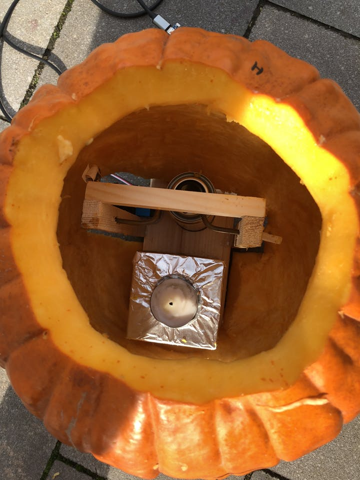
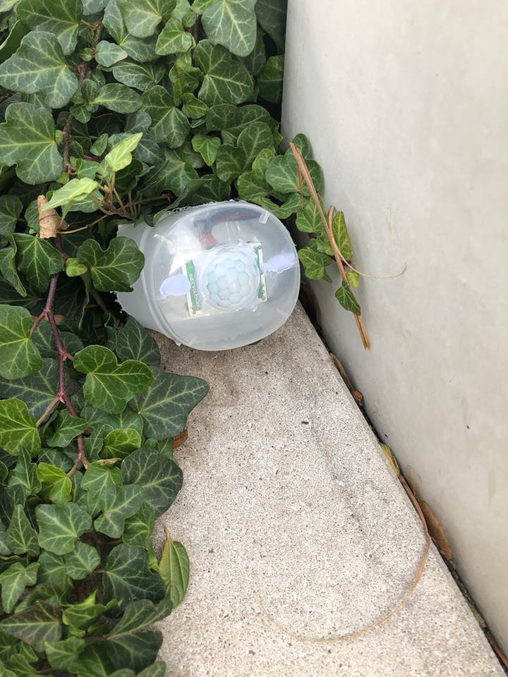
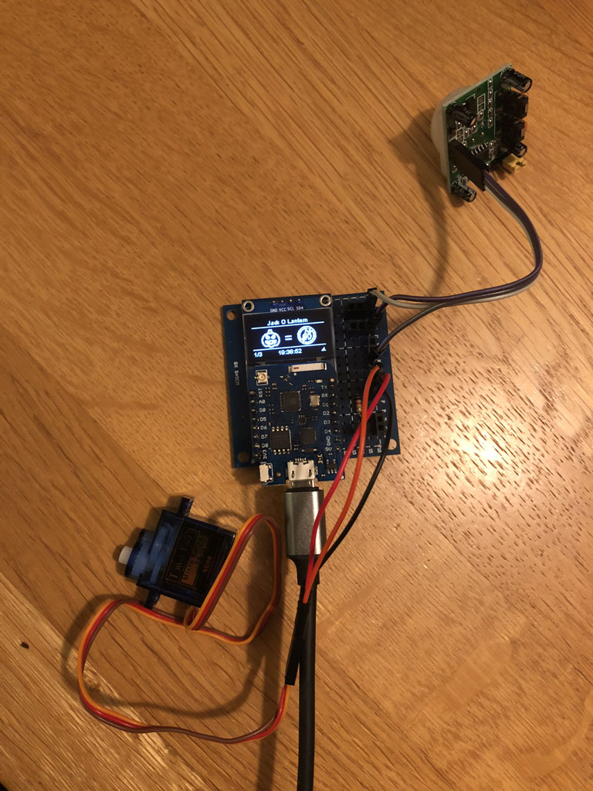

## Jack-O-Lantern Flamethrower

A flame throwing jack-o'-lantern is a real Halloween highlight and definitely something to impress the trick-or-treaters and your neighbors. An internet controlled IoT flame throwing jack-o'-lantern is even better.

This Jack-O-Lantern is internet connected and can be controlled via MQTT protocol. That way the project can be integrated into a home automation solution like [OpenHab](https://www.openhab.org) or [Home Assistant](https://www.home-assistant.io) to control the flamethrower from there or via Alexa or Google Home.

<div class="video-container"><iframe width="615" height="352" src="https://www.youtube.com/embed/jMbAKtgw04k" frameborder="0" allow="accelerometer; autoplay; encrypted-media; gyroscope; picture-in-picture" allowfullscreen></iframe></div>

Your are "not so much" interested in Halloween? This is for you as well, a little fire will make even the most bold of people think twice about approaching your door.

This is actually my second version of the flame throwing jack-o'-lantern 😀 I already build one last year using a modified room spray (like [this project](https://www.hackster.io/Dlbates/iot-flaming-and-talking-pumpkin-using-aws-and-esp8266-49934f)). But these do not allow to control the flame directly so I decided I need to build a more pro version which allows to control the duration of the flame.

**Warning**: This pumpkin and playing with fire is extremely dangerous and you definitely should not make one of these. I do not endorse the manufacture or use of flamethrowers jack-o'-lanterns. The following project description is posted here are for research and entertainment purposes only.

If you are going to rebuild this project you do it at your own risks. Read the warning above - twice! Also make sure the place the pumpkin at a safe location to not harm anybody or burn down your own house!

### Hardware
The following components are needed:

* A big pumpkin
* Penetrating fluid like WD-40 or cheaper replacement, it's just going to be burned anyway
* A tea candle
* Material for the flamethrower construction to hold the spray can
* ESP8266 (Wemos D1 mini, Nodemcu) or ESP32
* 1-3 PIR motion sensors
* Strong servo motor
* SSD1306 display (optional)
* Prototyping board
* male & female pin headers
* USB cable and power supply

The display is not really needed for this project, it is just used for fun to display some little animation and information which of the motion sensors triggered the fire.

As usual I got the most parts from [Aliexpress](https://www.aliexpress.com) but all the parts should be available via other sources like ebay or amazon.com as well.

###Tools
These are the tools needed:

* A cutting knife
* A marker
* Soldering iron with solder
* Tools to construct the flame throwing mechanism

## The flamethrower
Ok, again: only build this if you have read the warning and are sure what you are doing!

The key element of this project is burning penetrating fluid which if sprayed direct into a candle burns like a small flamethrower.

There are multiple ways to build the flamethrower. I used old wood pieces covered with aluminum foil to mount the spray can and candle. Maybe not the optimal solution but working, using metal parts would be a slightly better way.


Bend the thick wire like on the picture above. It should be a big lever as possible to make the most of the power of the servo motor. Hot glue or screw down the servo at the side of the construction and mount it with the wire. The lever will press down the spray nozzle when the servo is activated.

## The pumpkin
The pumpkin is of course the most important part for a project like this 😉

First cut around the stem of the pumpkin at an angle. The top cover should be big enough, so you can later easily mount the flame thrower construction. After done cutting all the way around, remove the stem and the guts from the pumpkin. Depending on the size of the project you also need to cut out the bottom to fit in the flamethrower construction. If you have a very large pumpkin this might not be needed.

Use the marker to mark jack-o'-lanterns face. The mouth should be at the position of the spray nozzle, so that the flame can flow out well. Make sure it is big enough so that there is no setback of the flame. I the pumpkin is not big enough the flame can also be fired through a bigger nose hole. Cut the face as marked.

Place the flamethrower construction inside the pumpkin. Fix it with hot glue to stabilize it. Connect the electronics with the servo motor wires. If enough space the electronics can be place inside the pumpkin and the PIR sensors can be inside jack-o'-lanterns eyes. Make sure you have a sufficient distance between the electronic parts and the flame.



If you have a smaller pumpkin, with not enough space inside the electronics can also be placed outside. I prefer this setup because it makes you more flexible when placing the PIR motion sensors.

The PIR motions sensors got some protection cover and and habe been places to recognise the movement of approaching trick-or-treaters.



## The electronics
The PIR motion sensors and the servo must be connected to the Wemos / ESP8266 board, you can use any of the Dx pins, expect D0 & D1. These two will be used by the OLED display. Connect power via USB adapter or battery pack.


Find detailed wiring instructions and an overview which pins are used by the software on [GitHub](https://github.com/mhaack/halloween-pumpkin-fire).

## The software
The software project for the ESP8288 board can be found in my [GitHub](https://github.com/mhaack/halloween-pumpkin-fire) repository.

After uploading the software to the board it has to be configured to connect to WiFi and MQTT. Homie provides multiple ways to do this, I prefer to create and upload a config file. Alternatively the configuration UI can be used.

My test setup looked like this:



The code is writen in C++, `halloween.cpp` is the main class.

The following software libraries are used. If using PlatformIO all dependencies are resolved automatically.

-   [Homie V2](https://github.com/marvinroger/homie-esp8266) including dependencies
-   [SSD1306 driver for ESP8266 platform](https://github.com/squix78/esp8266-oled-ssd1306)
-   [NTPClient to connect to a time server](https://github.com/arduino-libraries/NTPClient)
-   Optionally PlatformIO environment for building the code

## The IoT part

I used [Homie](https://github.com/marvinroger/homie-esp8266) to better modularize the software parts into dedicated "nodes" to control the servo, the display and get the PIR motion sensor inputs. Homie provides the MQTT protocol support, see [Homie specification](https://git.io/homieiot) for details.

### MQTT commands and config

The flamethrower supports one import command: switch on the fire 😀. It can be triggered via MQTT with `homie/<device id>/fire/on/set` with the value `true`.

Command line example:

```
mosquitto_pub -h <mqtt broker host> -t homie/<device id>/fire/on/set -m true
```

Where &lt;devie id&gt; is the name of the device assigned during configuration and &lt;mqtt broker host&gt; the hostname or ip address of your MQTT broker. This should make it easy to integrate it into home automation solution. I run OpenHab and integrated it there, just for the fun of controlling the fire via my mobile.


The following config parameters are available via config file or MQTT message (see Homie documentation how to use):

| Parameter    | Type | Usage                                                                                           |
| ------------ | ---- | ----------------------------------------------------------------------------------------------- |
| fireInterval | long | min. interval in sec between flame activations (if motion was detected) to avoid permanent fire |
| fireDuration | long | duration of one flame shot in ms aka. time until servo moves back to initial position           |
| flipScreen   | bool | flip the display screen vertically                                                              |

## The final result
This is the Jack-O-Lantern on fire.


